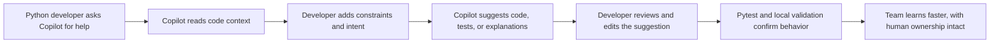
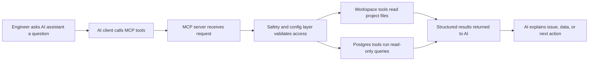

# GitHub Copilot Demo for Python Developers

This repository is set up as a practical demo environment for teaching GitHub Copilot to Python developers from scratch.

It gives you two things in one place:

- a real Python codebase you can use for live Copilot demos
- a structured beginner training pack for hands-on learning

## Demo Story

The simplest way to position this demo in a session is:

> "Copilot is not magic. It becomes useful when developers give it context, constraints, and review. This repo shows that in a real Python project."

## Visual Flow for the Demo

Use this diagram during your intro to explain how the demo works:



## What You Can Demo Live

### 1. Code explanation

Open [`src/app/server.py`](src/app/server.py) and ask Copilot to explain the control flow for a new Python engineer.

### 2. Test generation

Use [`tests/test_registry.py`](tests/test_registry.py) as a pattern and ask Copilot to draft tests for server metadata functions.

### 3. Safe refactoring

Open a small module like [`src/app/registry.py`](src/app/registry.py) or [`src/app/shared/filesystem.py`](src/app/shared/filesystem.py) and ask Copilot for a readability refactor without behavior change.

### 4. Beginner practice

Move learners into the lab in [`training/lab/README.md`](training/lab/README.md), where they can implement a small Python exercise with Copilot prompts.

## Training Assets

The repo now includes a ready-to-run training pack:

- Workshop guide: [`training/github-copilot-python-workshop.md`](training/github-copilot-python-workshop.md)
- Prompt cheat sheet: [`training/copilot-python-prompt-cheatsheet.md`](training/copilot-python-prompt-cheatsheet.md)
- Agent PR pipeline guide: [`training/github-agent-pr-demo.md`](training/github-agent-pr-demo.md)
- Beginner lab: [`training/lab/README.md`](training/lab/README.md)
- Starter exercise: [`training/lab/starter/order_summary.py`](training/lab/starter/order_summary.py)
- Reference implementation: [`training/lab/reference/order_summary_reference.py`](training/lab/reference/order_summary_reference.py)
- Reference tests: [`training/lab/reference/test_order_summary.py`](training/lab/reference/test_order_summary.py)

## Copilot Skills for the Demo

The repository also includes reusable Copilot customization files so you can demo "skills" instead of one-off prompts:

- Repository instructions: [`.github/copilot-instructions.md`](.github/copilot-instructions.md)
- Prompt skills library for IDE chat: [`.github/prompts/README.md`](.github/prompts/README.md)
- CLI custom agents for terminal use: [`.github/agents/README.md`](.github/agents/README.md)

These are useful for showing clients how a team can standardize onboarding, test generation, refactoring, debugging, and code review workflows inside GitHub Copilot.

In prompt-file-aware IDE clients, you can invoke the prompt files with slash commands derived from the filename, for example `/python-code-review`. In GitHub Copilot CLI, use `/agent` and select the matching `python-*` custom agent instead.

## Suggested 90-Minute Session Flow

1. Explain what GitHub Copilot is and is not.
2. Show inline completion, chat, and edit workflows.
3. Run a live demo in the existing Python codebase.
4. Let learners complete the beginner lab.
5. Close with review habits, guardrails, and prompt patterns.

The full facilitator version lives in [`training/github-copilot-python-workshop.md`](training/github-copilot-python-workshop.md).

## Why This Repo Works Well for Training

- the codebase is real enough to feel credible
- the Python structure is simple enough for beginners to follow
- there are tests already in place, which helps teach verification
- the lab is isolated, so new users can practice safely

## Existing Python App Context

Under the training assets, this is still a working Python MCP server scaffold with:

- one `FastMCP` server process
- workspace, Postgres, GitHub, and Slack integration modules
- config-driven integration registration
- startup validation and server health tools
- pytest coverage for core behavior

If you want a more technical story during the demo, use this architecture view:



## Quick Start

1. Create a Python 3.11 virtual environment.
2. Install dependencies:

```bash
pip install -e ".[dev]"
```

3. Copy the example environment file:

```bash
cp .env.example .env
```

4. Run the server:

```bash
python3.11 -m app.server
```

Or use the installed console script:

```bash
mcp-multi-server
```

## Demo Visual Asset

A standalone animated visual for presentation or social sharing is available at [`linkedin-flow.html`](linkedin-flow.html).

You can open it in a browser and use it as:

- a workshop opening slide
- a short LinkedIn screen recording
- a visual explainer before the hands-on lab

## CI and Local Stack

CI is configured in [`.github/workflows/ci.yml`](.github/workflows/ci.yml) to:

- install the project on Python 3.11
- compile the source tree
- run the test suite

For a repeatable local setup with Postgres, use [`docker-compose.yml`](docker-compose.yml):

```bash
docker compose up --build
```

That stack starts:

- a Postgres 16 container on `localhost:5432`
- the MCP server container with the Postgres integration enabled

## Notes for Facilitators

- start with a small, obvious Copilot win
- narrate why you accept or reject a suggestion
- remind learners that developers own correctness
- use tests as part of the story, not as an afterthought

## Verification

The beginner lab reference tests can be run with:

```bash
pytest -q training/lab/reference/test_order_summary.py
```
